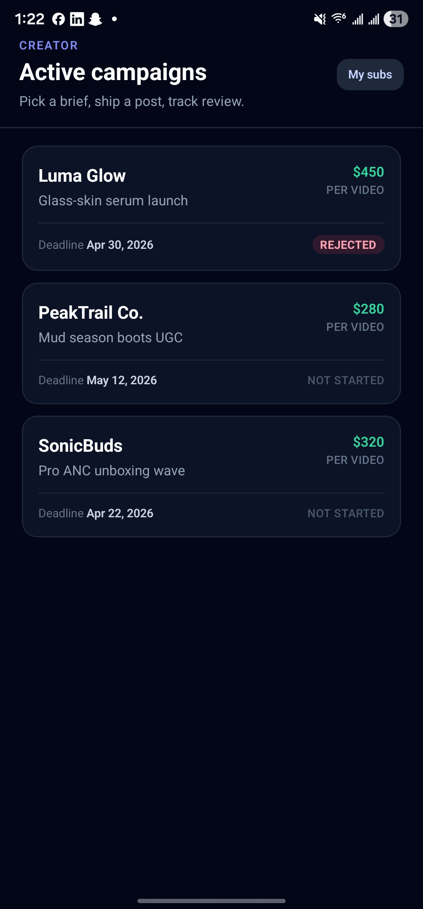
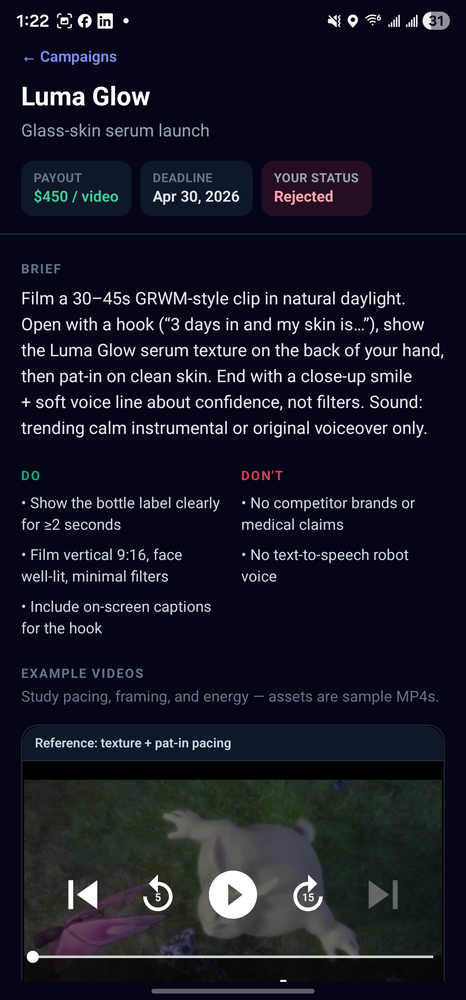
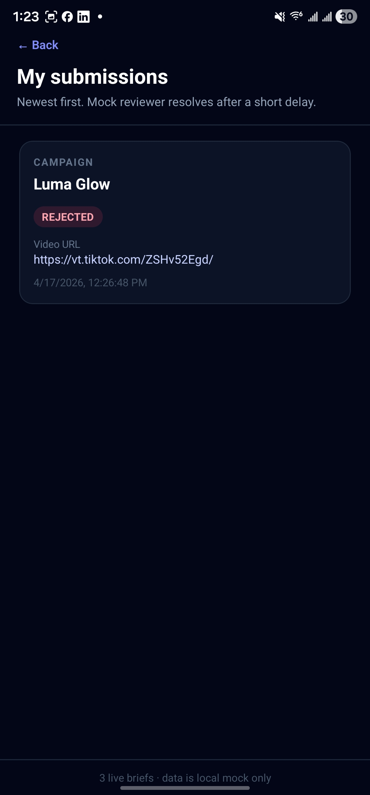

# Creator campaigns (Expo)

A small **creator-facing** mobile flow: browse mocked brand campaigns, read a brief, watch example clips, submit a **TikTok or Instagram** post URL, and see a **mock** review status (pending → approved or rejected). There is **no backend**; everything is local state.

## Screenshots

Project captures: **campaign list** → **campaign detail** (brief, examples, submit) → **my submissions**.

**If images are blank in the editor preview:** open the preview’s **⋯** / shield banner → **Markdown: Change preview security settings** → choose **Allow insecure content** (or **Disable** for this repo only). Strict mode sometimes blocks local files in the webview. On **GitHub.com** the same paths render after you push.

### 1 · Campaigns

<p align="left">
  
</p>

### 2 · Campaign detail

<p align="left">
  
</p>

### 3 · My submissions

<p align="left">
  
</p>

## Stack

- [Expo SDK 54](https://docs.expo.dev/) + React Native + TypeScript  
- [React Navigation](https://reactnavigation.org/) (native stack)  
- [NativeWind v4](https://www.nativewind.dev/) + Tailwind CSS (`className` on RN views)  
- [expo-video](https://docs.expo.dev/versions/latest/sdk/video/) for example playback

## Requirements

- Node.js 18+ (LTS recommended)  
- [Expo CLI](https://docs.expo.dev/get-started/installation/) via `npx`  
- **iOS:** Xcode + Simulator (macOS), or Expo Go on a device  
- **Android:** Android Studio / emulator, or Expo Go

## Run

```bash
npm install
npx expo start
```

Then press `i` / `a` for simulator, or scan the QR code with **Expo Go**. Use `**npm start`** (not `node start`).

Clear Metro if styles or native modules act stale:

```bash
npx expo start --clear
```

Check dependency alignment with Expo:

```bash
npx expo-doctor
```

## What’s in the app


| Screen              | Purpose                                                                                          |
| ------------------- | ------------------------------------------------------------------------------------------------ |
| **Campaigns**       | List mocked campaigns: brand, payout per video, deadline, quick status if you already submitted. |
| **Campaign detail** | Brief, do/don’t, two **example videos** (remote MP4s), URL field, submit.                        |
| **My submissions**  | All submissions with status and link back to the campaign.                                       |


**Submit URL:** Must be `https://` and host looks like TikTok or Instagram (`tiktok.com`, `instagram.com`, `instagr.am`).

**Mock review:** Each new row starts as `pending`, then after a short delay resolves to `**approved` or `rejected`** in an alternating pattern per campaign (first submission for that campaign → rejected, second → approved, etc.). Adjust logic in `src/context/SubmissionsContext.tsx`.

## Project layout

```
App.tsx                 # Root: global CSS, providers, navigator
index.ts                # Entry (gesture-handler first)
global.css              # Tailwind layers for NativeWind
src/
  components/ExampleVideoCard.tsx
  context/SubmissionsContext.tsx
  data/campaigns.ts     # Mock campaigns + briefs
  data/sampleVideoUrls.ts
  navigation/RootNavigator.tsx
  navigation/types.ts
  screens/              # Campaign list, detail, submissions
ai-log/                 # Optional export of a Cursor agent transcript (see ai-log/README.md)
```

## Customizing

- **Campaigns / briefs / titles:** `src/data/campaigns.ts`  
- **Example video URLs:** `src/data/sampleVideoUrls.ts` (use HTTPS hosts that allow mobile streaming; some CDNs return 403 to players)

## Development time

The Cursor transcript JSONL does not include per-message timestamps. `ai-log/CHAT-EXPORT.md` documents the only **objective** clock span we could attach: **filesystem birth → mtime** on the transcript file (not a human estimate). Re-`stat` that file if you re-export the log.

## License

Private / internal unless you add a license.